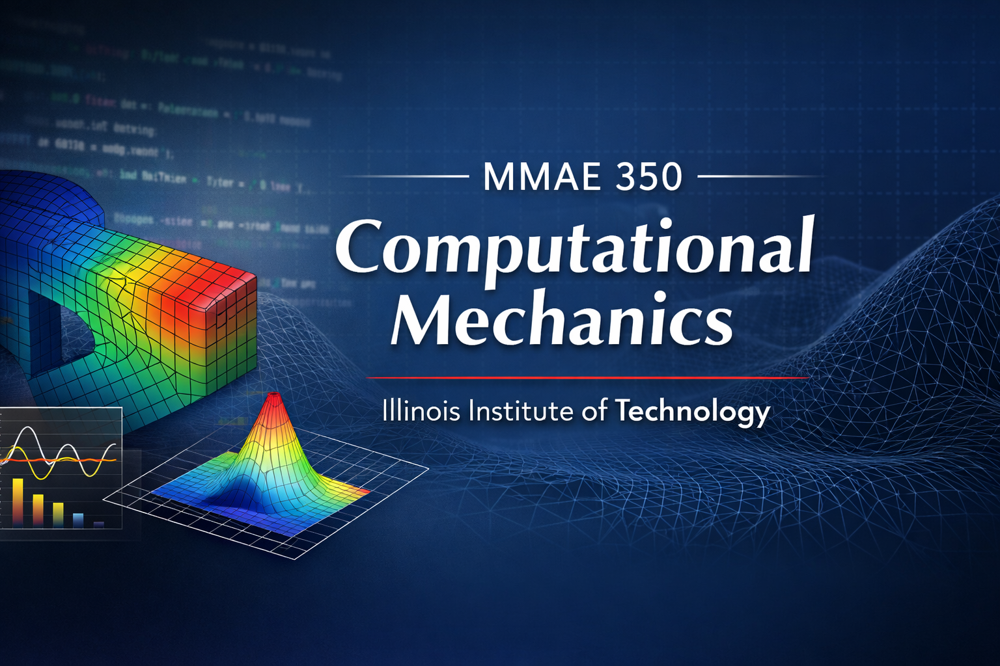

<p align="center">
  
</p>

# MMAE 350 --- Computational Mechanics

This repository contains public course materials for **MMAE 350:
Computational Mechanics**\
offered by the Department of Mechanical, Materials, and Aerospace
Engineering\
at the Illinois Institute of Technology.

Computational methods are central to modern engineering practice. This
course develops the mathematical foundation, numerical algorithms, and
computational workflows used to model and solve engineering problems
using Python.

------------------------------------------------------------------------

## Course Overview

**MMAE 350 -- Computational Mechanics** introduces numerical methods
used in mechanical and aerospace engineering, with emphasis on the
computational solution of governing equations arising in physical
systems.

Students develop computational fluency using **Python and Jupyter
notebooks**, and apply numerical methods to engineering problems in:

-   Heat transfer\
-   Wave propagation\
-   Transport phenomena\
-   Conservation laws

The course connects mathematical formulation, physical modeling, and
computational implementation. Students learn to:

-   Formulate engineering problems in matrix and vector form\
-   Solve systems of linear algebraic equations using direct and
    iterative methods\
-   Apply Newton's method to nonlinear equations and systems\
-   Derive and implement finite-difference schemes for steady and
    transient PDEs\
-   Analyze stability and accuracy of numerical time-marching methods\
-   Solve 1D and 2D heat conduction problems\
-   Implement introductory finite-volume methods\
-   Construct basic one-dimensional finite element approximations

Throughout the semester, emphasis is placed on:

-   Clear mathematical formulation\
-   Algorithm development\
-   Structured computational workflows\
-   Interpretation of numerical results in physical terms

------------------------------------------------------------------------

## Repository Structure

The repository is organized by instructional modules.

### Modules

The `modules/` directory contains the primary instructional materials
for each topic area.\
Each module typically includes:

-   A `README.md` describing learning objectives\
-   Lecture slides (PDF format)\
-   Companion Jupyter notebooks for in-class demonstrations and guided
    exploration

```{=html}
<!-- -->
```
    modules/
    ├── module00_setup/
    ├── module01_matrix_algebra/
    ├── module02_linear_systems/
    └── module03_nonlinear_systems/

Students should begin each module by reviewing the module-level README
file.

------------------------------------------------------------------------

### Homework

The `homework/` directory contains homework assignments and any
associated starter notebooks distributed to students.

    homework/
    ├── hw01/
    ├── hw02/
    ├── hw03/
    └── ...

Homework submission procedures are managed through the course learning
management system.

------------------------------------------------------------------------

### Data

The `data/` directory contains shared input files used in demonstrations
and computational experiments.

------------------------------------------------------------------------

### Tools and Environment Setup

The `tools/` directory contains environment configuration files and
supporting scripts.

Students should complete **Module 00 --- Setup** before beginning other
course work. This module provides step-by-step guidance for installing
Python, creating a virtual environment, and configuring Jupyter.

------------------------------------------------------------------------

## How to Use This Repository

This repository is intended to be used locally on your own machine.\
Students should **clone** the repository rather than downloading
individual files.

### Step 1 --- Install Git (if needed)

If Git is not already installed:

-   macOS: Install Xcode Command Line Tools

    ``` bash
    xcode-select --install
    ```

-   Windows: Install Git from https://git-scm.com\

-   Linux: Use your distribution's package manager

------------------------------------------------------------------------

### Step 2 --- Clone the Repository

Open a terminal (Mac/Linux) or Git Bash (Windows), navigate to the
directory where you want the course folder to live, and run:

**Using SSH:**

``` bash
git clone git@github.com:gosz450/mmae350-public.git
```

**Using HTTPS:**

``` bash
git clone https://github.com/gosz450/mmae350-public.git
```

This will create a folder named:

    mmae350-public

Move into the directory:

``` bash
cd mmae350-public
```

------------------------------------------------------------------------

### Step 3 --- Set Up Your Python Environment

Complete **Module 00 --- Setup** before running any notebooks.

After activating your virtual environment, launch Jupyter:

``` bash
jupyter notebook
```

or

``` bash
jupyter lab
```

Then navigate to the appropriate module and open the notebook.

------------------------------------------------------------------------

### Updating the Repository During the Semester

New materials may be added throughout the semester.\
To update your local copy, run:

``` bash
git pull
```

from inside the `mmae350-public` directory.

------------------------------------------------------------------------

## Software Requirements

-   Python 3.10 or newer\
-   Jupyter Notebook or JupyterLab\
-   NumPy\
-   SymPy\
-   Matplotlib

Full installation instructions are provided in Module 00.

------------------------------------------------------------------------

## Instructor

**Mike Gosz**\
Department of Mechanical, Materials, and Aerospace Engineering\
Illinois Institute of Technology

------------------------------------------------------------------------

© Illinois Institute of Technology. Course materials are provided for
educational use.
