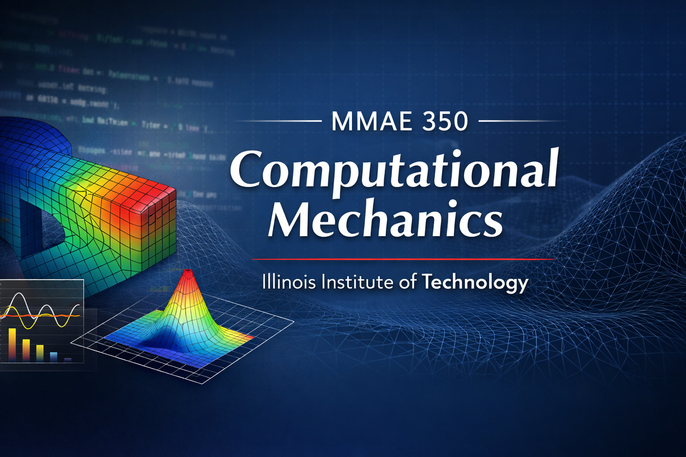

<p align="center">
  
</p>

# MMAE 350 — Computational Mechanics

**Fall 2026**  
Illinois Institute of Technology  
School of Engineering, Applied Science and Health

**Instructor:** Dr. Mike Gosz  
**Class Meetings:** Tuesday and Thursday, 10:00–11:15 a.m.  
**Location:** Stuart Building 113 (SB-113)

---

## Course Overview

This repository contains student-facing course materials for
**MMAE 350: Computational Mechanics**.

The course introduces computational methods used in mechanical and aerospace
engineering, with an emphasis on numerical solution of engineering governing
equations. Python and Jupyter notebooks are used throughout the course as
primary computational tools.

Topics include linear algebraic systems, nonlinear equations, finite-difference
methods, heat conduction, wave propagation, introductory finite element methods,
finite-volume methods, and computational fluid dynamics applications.

---

## Course Materials

Course materials will be released progressively throughout the semester.

The repository will contain:

- lecture slides
- Jupyter notebooks
- computational examples
- homework assignments and supporting files
- software setup instructions
- shared data files

Students should use **Canvas** for official course announcements, due dates,
assignment submission, grades, and other course administration.

---

## Repository Organization

### Modules

The `modules/` directory contains the core instructional materials for the course.

Each module may include:

- a `README.md` describing the topic and learning goals
- lecture slides
- companion Jupyter notebooks
- computational examples

For example:

```text
modules/
├── module00_setup/
├── module01_matrix_algebra/
├── module02_linear_systems/
└── ...
```

Additional modules will be released as the semester progresses.

---

### Homework

Homework assignments and supporting computational files will be added to the
`homework/` directory as they are assigned.

Homework submissions are made through **Canvas**, not through GitHub.

---

### Data

The `data/` directory contains shared input files used in demonstrations,
examples, and Jupyter notebooks.

---

### Software Setup and Tools

The `tools/` directory contains supporting files related to the Python
environment and other computational utilities used in the course.

Students should begin with **Module 00**, which provides instructions for
installing Python, creating the course virtual environment, and configuring
Jupyter.

---

## How Students Should Use This Repository

1. Clone or download the repository to your computer.
2. Complete **Module 00** to configure your computational environment.
3. As each module is released:
   - read the module README
   - review the lecture slides
   - work through the companion notebooks and computational examples
4. Complete homework assignments as posted.
5. Submit all required work through Canvas.

---

## Software Requirements

The course primarily uses:

- Python 3
- Jupyter Notebook
- NumPy
- SymPy
- Matplotlib
- related scientific Python libraries

See **Module 00** for detailed installation and configuration instructions.

---

## Syllabus

The current course syllabus is available here:

[Fall 2026 MMAE 350 Syllabus](syllabus/syllabus.pdf)

---

## Instructor

**Dr. Mike Gosz**  
School of Engineering, Applied Science and Health
Illinois Institute of Technology